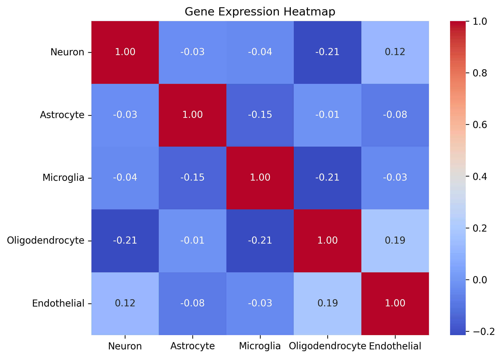
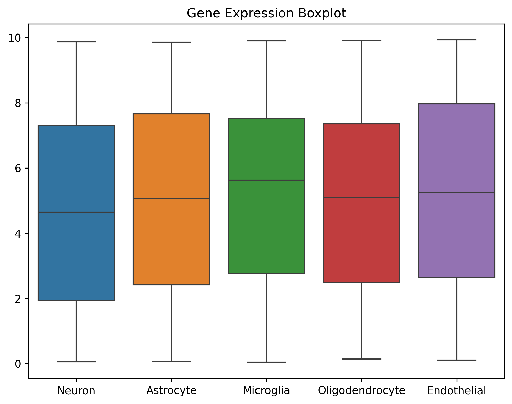
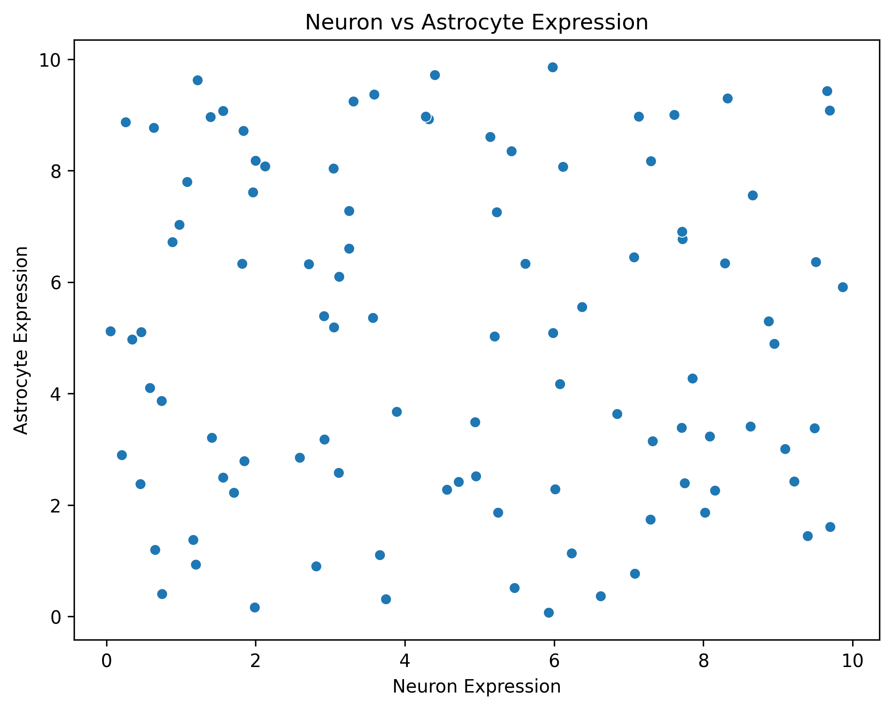

# 🧬 Gene Expression Analysis

This project analyzes **gene expression data** and visualizes it using **heatmaps, boxplots, and scatter plots**. The results can be used for **bioinformatics research, RNA-Seq analysis, and Power BI visualization**.

---

## **📌 Features**
- 💡 Generates **synthetic gene expression data** (or you can use real biological data).
- 🔥 **Heatmap** (Gene Correlation)
- 📦 **Boxplot** (Expression Distribution)
- 🎯 **Scatter Plot** (Neuron vs Astrocyte)
- 📚 **Exports Data**: Saves data as `CSV` for **Power BI & further analysis**.
- 💪 **Works in VS Code, Jupyter Notebook, & Terminal**.

---

## **📂 Project Structure**
```
gene-expression-analysis/
│── gene-expression-analysis.py  # Main Python script
│── gene_expression_heatmap.png  # Heatmap image
│── gene_expression_boxplot.png  # Boxplot image
│── gene_expression_scatterplot.png  # Scatter plot image
│── gene_expression_data.csv  # CSV file for Power BI
│── README.md  # Documentation
```

---

## **🚀 Installation**
### **Step 1: Clone the Repository**
```sh
git clone https://github.com/mubashir1837/GeneExpressionViz.git
cd GeneExpressionViz
```

### **Step 2: Install Dependencies**
```sh
pip install numpy pandas matplotlib seaborn
```

---

## **📝 Usage**
### **Step 1: Run the Script**
```sh
python gene-expression-analysis.py
```
### **Step 2: Check the Output**
- **Summary statistics** appear in the **terminal**.
- **3 graphs** will open one by one.
- **4 files** will be saved:
  - `gene_expression_heatmap.png`
  - `gene_expression_boxplot.png`
  - `gene_expression_scatterplot.png`
  - `gene_expression_data.csv`

---

## **📊 Output Examples**
### **1️⃣ Heatmap (Gene Correlation)**
Shows correlation between different **cell types**.
 
### **2️⃣ Boxplot (Expression Distribution)**
Displays variation in **gene expression** across different cell types.


### **3️⃣ Scatter Plot (Neuron vs Astrocyte)**
Shows the **relationship between Neuron & Astrocyte expression**.


### **4️⃣ CSV Data (for Power BI & Analysis)**
Data is saved in **CSV format** for external analysis.
```csv
Neuron,Astrocyte,Microglia,Oligodendrocyte,Endothelial
5.2,2.3,8.9,1.2,6.3
3.1,7.4,5.6,2.1,4.5
8.2,5.9,6.1,9.4,3.2
...
```
**Open in Python Pandas:**
```python
import pandas as pd
df = pd.read_csv("gene_expression_data.csv")
print(df.head())
```

---

## **🔧 Troubleshooting**
### **Graph is not showing in VS Code?**
Try:
```python
import matplotlib
matplotlib.use("TkAgg")  # Use an interactive backend
```
Or run:
```sh
python -m matplotlib
```

### **No module named `matplotlib`?**
Install missing libraries:
```sh
pip install matplotlib seaborn pandas
```

---

## **💚 License**
This project is open-source under the **MIT License**.

---

## **🤝 Contributing**
1. Fork the repo  
2. Create a new branch (`git checkout -b feature-branch`)  
3. Commit changes (`git commit -m "Added feature"`)  
4. Push to the branch (`git push origin feature-branch`)  
5. Open a pull request  

---

## **💌 Contact**
**Mubashir Ali**  
📧 [Email](mailto:mubashirali1837@gmail.com)  
🌐 [Portfolio Website](https://mubashir-a.vercel.app) 
🌐 [Website](https://codewithbismillah.vercel.app) 
🎥 **YouTube:** [CodeWithBismillah](https://www.youtube.com/@CodeWithBismillah)  
👉 **LinkedIn:** [MubashirAli](https://www.linkedin.com/in/mubashirali3)  

---

🔥 **Now you're ready to analyze and visualize gene expression data!** 🚀

